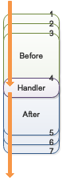
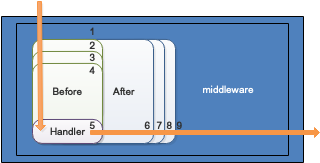

#mplus 🚍

**mplus** 是一个轻量级的非侵入式 http 请求处理辅助框架。具有以下特色：

- 能够灵活的将大量 middleware 组合成一个 http-Handler 直接使用。
- 能够在规划路由的时候定义需要绑定请求数据的 model 及校验规则，而不是在每个 Handler 内处理绑定及校验逻辑。
- 能够为你的路由设置前置或后置处理器（类似 middleware）。
- 无需改变你的路由定义，完全兼容 http 规范。
- 在 Handler 内托管 `http.ResponseWriter` 及 `http.Request` ，后续代码通过简便的 API 完成请求的响应。
- 提供了 Query 对象，能够动态地链式完成 `URI` 及字段值的拼接，而非官方繁杂的处理流程。
- 通过注册 errCode ，自动完成对应的响应状态码及响应消息处理。
- 提供重复读取 request.Body 内容的 API。
- 灵活配合其他框架使用。


##  目录结构

[TOC]

## 引入 mplus

1. use the below Go command to install mplus

```sh
$ go get -u github.com/tangzixiang/mplus
```

2. Import it in your code:

```go
import "github.com/tangzixiang/mplus"
```


## 快速开始

```bash
# assume the following codes in simple.go file
$ cat simple.go
```

```go
package main

import (
	"net/http"

	"github.com/tangzixiang/mplus"
)

func main() {
	http.ListenAndServe(":8080", mplus.MRote().HandlerFunc(Hello))
}

// Handler
func Hello(w http.ResponseWriter, r *http.Request) {
	// take you w,r then give you a plus
	mplus.PlusPlus(w, r).JSONOK(map[string]string{"data": "hello world"})
}

```

```bash
# run server
$ go run simple.go
```

```bash
# request the server api
$ curl localhost:8080

{"data":"hello world"}
```


## 功能

### 使用自定义中间件

恰当的使用中间件，能够大大提升代码的可维护性，使用中间件能够实现 [`AOP`]([https://zh.wikipedia.org/wiki/%E9%9D%A2%E5%90%91%E5%88%87%E9%9D%A2%E7%9A%84%E7%A8%8B%E5%BA%8F%E8%AE%BE%E8%AE%A1](https://zh.wikipedia.org/wiki/面向切面的程序设计)) 面向切面编程的思想，降低代码的耦合度。

> **面向切面的程序设计**（Aspect-oriented programming，AOP，又译作**面向方面的程序设计**、**剖面导向程序设计**）是[计算机科学](https://zh.wikipedia.org/wiki/计算机科学)中的一种[程序设计思想](https://zh.wikipedia.org/wiki/编程范型)，旨在将**横切关注点**与业务主体进行进一步分离，以提高程序代码的模块化程度

**mplus** 的中间件分为以下三种：

- **前置请求处理器**：只在 Handler 前执行
- **后置请求处理器**：只在 Handler 后执行
- **middleware** ：自定义与 Handler 之间的执行关系


#### 设置前置请求处理器完成计数功能

使用前置请求处理器，能为你将 Handler 内的部分前置逻辑进行抽离，提供更好的可维护性。

- `mplus.MRote().Before(...http.HandlerFunc)` 为当前请求添加前置请求处理
- `mplus.MRote().BeforeHandler(...http.Handler)` 为当前请求添加前置请求处理


```go
var num = 0

func main() {
	http.ListenAndServe(":8080", mplus.MRote().Before(AddNum).HandlerFunc(Num))
}

// increase num per request
func AddNum(w http.ResponseWriter, r *http.Request) {
	num ++
}

// Handler
func Num(w http.ResponseWriter, r *http.Request) {
	mplus.PlusPlus(w, r).JSONOK(map[string]string{"num": num})
}

```


#### 同时使用前置及后置请求处理器控制访问量

同样的，你能为你的 Handler 中的部分逻辑添加至后置请求处理器，在后置处理器中，你能做一些不影响当前业务的附带行为。

- `mplus.MRote().After(...http.HandlerFunc)` 为当前请求添加后置请求处理
- `mplus.MRote().AfterHandler(...http.Handler)` 为当前请求添加后置请求处理


```go
var lastVisitIndex = 0

func main() {
	http.ListenAndServe(":8080",
               mplus.MRote().Before(MaxVisitTimesControl).After(AddNum).HandlerFunc(Num))
}

// MaxVisitTimesControl as a before handler control visit times
func MaxVisitTimesControl(w http.ResponseWriter, r *http.Request) {
	if lastVisitIndex > 10 {
		mplus.PlusPlus(w, r).Forbidden() // return status cod 403
	}
}

// AddNum as an after handler increase num per request
func AddNum(w http.ResponseWriter, r *http.Request) {
	lastVisitIndex ++
}

// Handler
func Num(w http.ResponseWriter, r *http.Request) {
	mplus.PlusPlus(w, r).JSONOK(map[string]int{"num": lastVisitIndex})
}
```


#### 使用 middleware 中间件

当然，你也可以直接使用 middleware 灵活控制与 Handler 的关系

- `mplus.MRote().Use(...MiddlewareHandlerFunc)` 为当前请求组合中间件
- `mplus.MRote().UseHandlerMiddleware(...MiddlewareHandler)` 为当前请求组合中间件

```go
func main() {
	http.ListenAndServe(":8080", mplus.MRote().Use(SetRequestID).HandlerFunc(Hello))
}

// use middleware to set requestID per request
func SetRequestID(next http.HandlerFunc) http.HandlerFunc {
	return func(w http.ResponseWriter, r *http.Request) {
		w.Header().Add(mplus.HeaderRequestID, uuid.Must(uuid.NewV4()).String())// "X-Request-Id"

		// call next ,may be is Handler or next middleware
		next.ServeHTTP(w, r)
	}
}

// Handler
func Hello(w http.ResponseWriter, r *http.Request) {
	mplus.PlusPlus(w, r).JSONOK(map[string]string{"data": "hello world"})
}

```


**mplus** 同时支持在 middleware 中使用，除了能够帮你托管 `ResponseWriter` 和 `Request` 还支持托管 `http.Handler` 即上述 `SetRequestID` middleware 的 `next` 参数：

```go
// use middleware to set requestID per request
func SetRequestID(next http.HandlerFunc) http.HandlerFunc {

	return func(w http.ResponseWriter, r *http.Request) {
    
    // write "X-Request-Id" to resp’s head then call next by mplus which take next handler
		mplus.PlusPlus(w,r).WriteRespHeader( 
      mplus.HeaderRequestID, uuid.Must(uuid.NewV4()).String()).Handler(next).ServeHTTP()
	}
}
```

该版本的 `SetRequestID` 效果与上一个版本相同。


#### 中间件与 HTTP-Handler 之间的交互

在某些时候我们可能需要在中间件之间专递信息，或则需要将信息从中间件传递到实际的 Handler 中。**mplus** 提供了相应的 `Get/Set` 方法集用于处理缓存于当前上下文中的数据

- `mplus.PP.Get(key string)` 从当前请求的上下文中获取指定数据
- `mplus.PP.GetDf(key string, defaultValue interface{})` 从当前请求的上下文中获取指定数据，不存在则返回默认值
- `mplus.PP.Set(key string, value interface{})` 将指定数据放入当前请求的上下文中
- `mplus.PP.SetR(key string, value interface{})` 将指定数据放入当前请求的上下文中，并返回当前数据

```go
type User struct {
	Name string `json:"name"`
}

func main() {
	http.ListenAndServe(":8080", mplus.MRote().Use(SetRequestID, PreSearchUser).HandlerFunc(Hello))
}

// use middleware to set requestID per request
func SetRequestID(next http.HandlerFunc) http.HandlerFunc {

	return func(w http.ResponseWriter, r *http.Request) {
		pp := mplus.PlusPlus(w, r).Handler(next)

		// add "X-Request-Id" to request's context and header at the same time
		pp.WriteRespHeader(mplus.HeaderRequestID, 
      pp.SetStringR(mplus.HeaderRequestID, uuid.Must(uuid.NewV4()).String()))

		// call next
		pp.ServeHTTP()
	}
}

const KeyUser = "user"

// use middleware to check user before handler
func PreSearchUser(next http.HandlerFunc) http.HandlerFunc {

	return func(w http.ResponseWriter, r *http.Request) {

		pp := mplus.PlusPlus(w, r).Handler(next)

    // search user by id which get from url then add to request's context
		pp.Set(KeyUser, SearchUserService(pp.Query("id")))

		// call next
		pp.ServeHTTP()
    
    // Or complete all steps at once as follows
    // mplus.PlusPlus(w, r).Handler(next).
    // Set(KeyUser, SearchUserService(pp.Query("id"))).ServeHTTP()
	}
}

func SearchUserService(id string) *User {
	return &User{"tom"}
}

// Handler
func Hello(w http.ResponseWriter, r *http.Request) {

	pp := mplus.PlusPlus(w, r)

	requestID := pp.Get(mplus.HeaderRequestID) // get requestID from request's context
	userName := pp.Get(KeyUser).(*User).Name   // get user from request's context

	pp.JSONOK(mplus.Data{"request_id": requestID, "message": "hello " + userName})
}

```

```bash
$ curl http://localhost:8080?id=1

< HTTP/1.1 200 OK
{"message":"hello tom","request_id":"9ccadf01-cfdf-4822-b528-3a1b6e79987a"}
```


#### 前置/后置请求处理器与 middleware 中间件之间的关系

每个 Handler 都可以与任意的 `Before` 、 `After` 及 `middleware` 进行搭配，他们之间的关系如下:

- `Before` 及 `After` 与 Handler 进行组合, 执行顺序如下：



- `middleware` 与 Handler 进行组合，执行顺序如下：


- `Before` 、 `After` 及 `middleware` 同时与 Handler 进行组合, 执行顺序如下：




### 绑定 model 并校验请求数据有效性

在日常的 API 开发中，我们经常需要在 Handler 中将请求数据映射到指定对象上并进行数据校验，然后再传递到其他地方进行后续处理，用原始的方式你需要写大量的处理代码，mplus 可以大大降低你的代码量。


**mplus** 内置使用 **[validator](https://github.com/go-playground/validator)** 作为 JSON 数据规则校验引擎

- `mplus.MRote().Bind(interface{})` 为当前请求绑定指定数据类型
- `mplus.RegisterValidateErrorFunc(ValidateErrorType,func(http.ResponseWriter,*http.Request, error))` 注册一个数据校验异常处理 Hook

```go
type V struct {
	Addr string `json:"addr" validate:"min=10"` // min len is 10
}

func main() {
  // (*V)(nil) mean that is a nil point which hold type info
  // bind model just need type info
	http.ListenAndServe(":8080", mplus.MRote().Bind((*V)(nil)).HandlerFunc(Address))
}

// Handler
func Address(w http.ResponseWriter, r *http.Request) {
	pp := mplus.PlusPlus(w, r)

	// pass to response data is V instance from request data
	pp.JSONOK(pp.VO().(*V))
}
```

```bash
# request success
$ curl --request POST \
>   --url http://localhost:8080/ \
>   --header 'content-type: application/json' \
>   --data '{"addr":"广东省深圳市南山区 xxx 号"}'

{"addr":"广东省深圳市南山区 xxx 号 :)"}
```

```bash
# request failed
$ curl --request POST \
>   --url http://localhost:8080/408 \
>   --header 'content-type: application/json' \
>   --data '{"addr":""}' 

< HTTP/1.1 400 Bad Request
```


如果需要了解到校验过程中具体发生异常的内容，可以添加如下 Hook 定义响应输出的内容

```go
func main() {
	// register a hook to show err message when validate failed
	mplus.RegisterValidateErrorFunc(mplus.ErrBodyValidate, 
                                  func(w http.ResponseWriter, r *http.Request, err error) {
                                    
		mplus.PlusPlus(w, r).JSON(mplus.Data{"err_message": err.Error()}, 400)
	})

	http.ListenAndServe(":8080", mplus.MRote().Bind((*V)(nil)).HandlerFunc(Address))
}
```

```bash
$ curl --request POST \
>   --url http://localhost:8080/408 \
>   --header 'content-type: application/json' \
>   --data '{"addr":""}' 

< HTTP/1.1 400 Bad Request
{"err_message":"Key: 'V.Addr' Error:Field validation for 'Addr' failed on the 'min' tag"}
```


#### form 数据的绑定

**mplus** 同时内置 **[form](github.com/go-playground/form)** 作为  `querystring` 及 `form` 格式数据的解析引擎，这样你便能通过 `Bind` 同时绑定请求体数据内容及URL 上的数据内容

```go
// tag “form”, can parse parameter from URL or form-data
type V struct {
	Addr string `form:"addr" validate:"min=10"` // min len is 10
}
```

```bash
# addr on URL
$ curl http://localhost:8080?addr=广东省深圳市南山区xxxx

< HTTP/1.1 200 OK
{"addr":"广东省深圳市南山区xxxx"}
```

```bash
# by application/x-www-form-urlencoded
$ curl http://localhost:8080 --data 'addr=广东省深圳市南山区xxxx'

< HTTP/1.1 200 OK
{"addr":"广东省深圳市南山区xxxx"}
```

```bash
# Request body parameters take precedence over URL query string values
$ curl http://localhost:8080?addr=广东省深圳市南山区yyyyy --data 'addr=广东省深圳市南山区xxxx'

< HTTP/1.1 200 OK
{"addr":"广东省深圳市南山区xxxx"}
```


如果 **[validator](https://github.com/go-playground/validator)** 及  **[form](github.com/go-playground/form)**  不能满足你的校验规则，你还能为当前 model 自定义校验逻辑进行补充

```go
type V struct {
	Addr string `json:"addr" validate:"min=10"` // min len is 10
}

// implement mplus.RequestValidate
func (v V) Validate(r *http.Request) (ok bool /*校验是否成功*/, errMsg string /*校验失败的原因*/) {

	if strings.Index(v.Addr, "广东") != 0 {
		return false, "addr must begin 广东"
	}

	return true, ""
}


func main() {
	// register a hook to show err message when validate failed by model.Validate
	mplus.RegisterValidateErrorFunc(mplus.ErrRequestValidate, 
                                  func(w http.ResponseWriter, r *http.Request, err error) {
                                    
		mplus.PlusPlus(w, r).JSON(map[string]string{"err_message": err.Error()}, 400)
	})

	http.ListenAndServe(":8080", mplus.MRote().Bind((*V)(nil)).HandlerFunc(Address))
}

// Handler
func Address(w http.ResponseWriter, r *http.Request) {
	pp := mplus.PlusPlus(w, r)

	// pass data to response
	pp.JSONOK(pp.VO())
}
```

```bash
$ curl --request POST \
>   --url http://localhost:8080/ \
>   --header 'content-type: application/json' \
>   --data '{"addr":"其他省深圳市南山区 xxx 号"}' 

< HTTP/1.1 400 Bad Request
{"err_message":"addr must begin 广东"}
```


#### 延迟计算 model 类型

如果你无法在声明路由的时候直接确定 Handler 绑定的 `model` 类型，传递一个用于延迟计算实际需要绑定的 `model` 类型的回调函数。

```go
// InsertUser use for insert a new one
type InsertUser struct {
	Account  string `json:"account"     form:"account"`
	Name     string `json:"name"        form:"name"`
	Password string `json:"password"    form:"password"`
}

// UpdateUser use for update name
type UpdateUser struct {
	Account string `json:"account"  form:"account"`
	Name    string `json:"name"     form:"name"`
}

// SelectBindModel will calculate which type of model to bind when handler got a request
func SelectBindModel(r *http.Request) (interface{}, error) {

	switch mplus.GetHeader(r, "X-Do-What") {
	case "update":
		return (*UpdateUser)(nil), nil
	case "insert":
		return (*InsertUser)(nil), nil
	}
  
  return nil, errors.New("bind type not found")
}

func main() {
	// register a hook to show err message when select model failed
	mplus.RegisterValidateErrorFunc(mplus.ErrModelSelect, 
                                  func(w http.ResponseWriter, r *http.Request, err error) {

		// {"err_message":"bind type not found"} 400
		mplus.PlusPlus(w, r).JSON(mplus.Data{"err_message": err.Error()}, 400)
	})

  handler := mplus.MRote().Bind(mplus.ValidateFunc(SelectBindModel)).HandlerFunc(Whatever)
	http.ListenAndServe(":8080",handler)
}

// Handler
func Whatever(w http.ResponseWriter, r *http.Request) {
	pp := mplus.PlusPlus(w, r)

  // got pp.VO() do anything
  
	// pass data to response
	pp.JSONOK(pp.VO())
}
```

```bash
# request failed
$ curl http://localhost:8080

< HTTP/1.1 400 Bad Request
{"err_message":"bind type not found"}
```

```bash
# request success by application/x-www-form-urlencoded
$ curl http://localhost:8080 --header 'X-Do-What: update' --data 'account=xxx@xxx&name=xxx'

< HTTP/1.1 200 OK
{"account":"xxx@xxx","name":"xxx"}
```

```bash
# request success by application/json
$ curl http://localhost:8080 \
>   --header 'X-Do-What: update' \
>   --header 'Content-Type: application/json' \
>   --data '{"account":"xxx@xxx","name":"xxx"}' 

< HTTP/1.1 200 OK
{"account":"xxx@xxx","name":"xxx"}
```


### 使用 Query 构造请求 URI

使用官方原始的 API 方式构造 URI 非常繁琐，举例如下：

```go
urlValues := make(url.Values)
urlValues.Add("name", "tom")
urlValues.Add("age", "15")
path := "http://localhost?" + urlValues.Encode()
```

mplus 能够让你的代码更优雅：

```go
mplus.NewQuery().AddPairs("name", "tom", "age", "15").AppendToURI("http://localhost")
```

上面两种方式都是同样能够输出 `http://localhost?age=15&name=tom` 。


**mplus** 还能做到更灵活，使用 `If` 及 `D` 命名结尾的相关函数能动态决定是否添加字段，与原始的官方 API 处理方式对比如下：

```go
var (
  values = map[string]bool{
    "name": false, // will be continue
    "age":  true,
  }
  urlValues = make(url.Values)
)

if values["name"] {
  urlValues.Set("name", "tom")
}
if values["age"] {
  urlValues.Set("age", "15")
}

fmt.Printf("%v\n", fmt.Sprintf("http://localhost/users/%v?", 1) + urlValues.Encode())

fmt.Printf("%v\n", mplus.NewQuery().
           SetIf(values["name"], "name", "tom").
           SetIf(values["age"], "age", "15").
           AppendToURIFormat("http://localhost/users/%v", 1))

// OutPut:
// http://localhost/users/1?age=15
// http://localhost/users/1?age=15
```

对于需要延迟计算的能力同样支持

```go
values := map[string]interface{}{
  "name": nil, // will be continue
  "age":  "15",
}

query := mplus.NewQuery().
  SetIfD(values["name"] != nil, "name", func() string { return values["name"].(string) }). 
  SetIfD(values["age"] != nil, "age", func() string { return values["age"].(string) })

fmt.Printf("%v\n",query.AppendToURI("http://localhost/users/1"))

// OutPut:
// http://localhost/users/1?age=15
```

甚至你能将字段的计算统一做延迟处理并封装到独立的函数内传递到 Query：

```go
query := mplus.NewQuery().SetPairsD(func() []string { // lazy dynamic
  values := map[string]int{
    "first":  1,
    "second": 2,
    "third":  3,
  }

  var pairs []string

  for key, value := range values {
    pairs = append(pairs, key, fmt.Sprint(value))
  }

  return pairs
})

fmt.Printf("%v\n",query.AppendToURI("http://localhost/users/1"))

// OutPut:
// http://localhost/users/1?first=1&second=2&third=3
```


### 便捷的 API 响应

HTTP 响应状态码指示特定 [HTTP](https://developer.mozilla.org/zh-cn/HTTP) 请求是否已成功完成。mplus 为常用的响应状态码提供了便捷的 API。

- `200` ：`mplus.PP.OK()`
- `400` ：`mplus.PP.BadRequest()`
- `401` :  `mplus.PP.Unauthorized()`
- `403` :  `mplus.PP.Forbidden()`
- `404` :  `mplus.PP.NotFound()`
- `405` :  `mplus.PP.NotAllowed()`
- `408` :  `mplus.PP.RequestTimeout()`
- `409` :  `mplus.PP.Conflict()`
- `415` :  `mplus.PP.UnsupportedMediaType()`
- `500` : `mplus.PP.InternalServerError()`
- more ...

示例如下：

```go
func main() {
	mux := http.NewServeMux()
	mr := mplus.MRote() // It's very easy to reuse
	
	//  response's status code is 200
	mux.Handle("/200", mr.HandlerFunc(func(w http.ResponseWriter, r *http.Request) {
    mplus.PlusPlus(w, r).OK()
	}))

	//  response's status code is 400
	mux.Handle("/400", mr.HandlerFunc(func(w http.ResponseWriter, r *http.Request) {
		mplus.PlusPlus(w, r).BadRequest()
	}))

	//  response's status code is 401
	mux.Handle("/401", mr.HandlerFunc(func(w http.ResponseWriter, r *http.Request) {

		// WWW-Authenticate: Basic
		// see https://developer.mozilla.org/en-US/docs/Web/HTTP/Status/401
		mplus.PlusPlus(w, r).WriteRespHeader(mplus.HeaderWWWAuthenticate, `Basic`).Unauthorized()
	}))
  
	//  response's status code is 403
	mux.Handle("/403", mr.HandlerFunc(func(w http.ResponseWriter, r *http.Request) {

		// chang default Date header
		// Date: Sat, 28 Sep 2019 01:58:43 GMT
    
		// TimeFormat is the time format to use when generating times in HTTP
		// headers. It is like time.RFC1123 but hard-codes GMT as the time
		// zone. The time being formatted must be in UTC for Format to
		// generate the correct format.
		mplus.PlusPlus(w, r).WriteRespHeader(
      mplus.HeaderDate, time.Now().Add(time.Hour).UTC().Format(http.TimeFormat)).Forbidden()
	}))
  
	//  response's status code is 404
	mux.Handle("/404", mr.HandlerFunc(func(w http.ResponseWriter, r *http.Request) {
		mplus.PlusPlus(w, r).NotFound()
	}))

	//  response's status code is 405
	mux.Handle("/405", mr.HandlerFunc(func(w http.ResponseWriter, r *http.Request) {

		// Allow: GET, POST, HEAD
		// see https://developer.mozilla.org/en-US/docs/Web/HTTP/Status/405
		mplus.PlusPlus(w, r).WriteRespHeader(mplus.HeaderAllow, "GET,POST,HEAD").NotAllowed()
	}))

	//  response's status code is 408
	mux.Handle("/408", mr.HandlerFunc(func(w http.ResponseWriter, r *http.Request) {

    // Connection: close
		// see https://developer.mozilla.org/en-US/docs/Web/HTTP/Status/408
		mplus.PlusPlus(w, r).WriteRespHeader(mplus.HeaderConnection, "close").RequestTimeout()
	}))

	//  response's status code is 500
	mux.Handle("/500", mr.HandlerFunc(func(w http.ResponseWriter, r *http.Request) {
		mplus.PlusPlus(w, r).InternalServerError()
	}))


	http.ListenAndServe(":8080", mux)
}
```

响应状态码系列 API 默认情况下会附带 `Content-Type` 为 `text/plain; charset=utf-8` 的 header，如果你不喜欢该系列 API 提供的默认行为，你可以对其行为进行更改：

- `mplus.RegisterHttpStatusMethod` 更改指定 HTTP 状态码的响应处理

```go
func main() {
	mux := http.NewServeMux()

  // register a StatusBadRequest hook to change default's behavior
	mplus.RegisterHttpStatusMethod(http.StatusBadRequest, 
                      func(w http.ResponseWriter, r *http.Request, m message.Message, statusCode int) {

		// {"err_message":"Bad Request"} 400 Bad Request
		mplus.PlusPlus(w, r).JSON(mplus.Data{"err_message": m.En()}, m.Status())
	})

	//  response's status code is 400
	mux.Handle("/400",  mplus.MRote().HandlerFunc(func(w http.ResponseWriter, r *http.Request) {
		mplus.PlusPlus(w, r).BadRequest()
	}))

	http.ListenAndServe(":8080", mux)
}
```

```bash
curl http://localhost:8080/400

< HTTP/1.1 400 Bad Request
{"err_message":"Bad Request"}
```


### 使用 errCode 规划 API 响应不同数据内容

在 API 开发过程中经常需要对不同的情况做不同的响应处理并返回对应的数据结果，第三方通过响应的数据结果内容判断 API 请求完成情况。


**mplus** 设计了一套通过 `errCode` 注册不同的响应结果处理逻辑，在 Handler 中只需要将预先定义好的 `errCode` 传递到 mplus，mplus 就能够对其执行预先注册的逻辑完成剩余的响应工作，而完成这个功能的媒介即 `Message`。

- `mplus.NewCallbackMessage(int,int,string,CallbackMessage)` 创建一个附带`Callbcak` 的 `Message`

- `mplus.Messages.Add(Message)`  添加一个 `Message`
- `mplus.pp.CallbackByCode(int,interface{})` 通过 `errCode` 触发指定的 `Callback`

```go
type V struct {
	Addr string `json:"addr" validate:"min=10"` // min len is 10
}

// errCode 400001
var ErrCodeAddrNotExists = 400001

// ErrCodeCallbackFun will be perform when ErrCodeAddrNotExists be use to PP.CallbackByCode
func ErrCodeCallbackFun(w http.ResponseWriter, r *http.Request, m mplus.Message, respData interface{}) {
  
  // {"code":400001,"message":"addr not exists"}
	mplus.JSON(w, r, mplus.Data{"message": m.En()}, m.Status())
}

func CheckAddr(string) bool {
	return false
}

func main() {

	// register a message for ErrCodeAddrNotExists
	mplus.Messages.Add(
    mplus.NewCallbackMessage(http.StatusBadRequest, ErrCodeAddrNotExists, "addr not exists", ErrCodeCallbackFun))

	http.ListenAndServe(":8080", mplus.MRote().Bind((*V)(nil)).HandlerFunc(Address))
}

// Handler
func Address(w http.ResponseWriter, r *http.Request) {
	pp := mplus.PlusPlus(w, r)

	if !CheckAddr(pp.VO().(*V).Addr) {

		//  pp search ErrCodeAddrNotExists message  pass to ErrCodeCallbackFun
		// second arg is respData pass to registered callback func on Messages -> ErrCodeCallbackFun
		pp.CallbackByCode(ErrCodeAddrNotExists, nil)
		return
	}

	pp.JSONOK(nil) // pass nil will specify mplus.EmptyRespData
}
```

```bash
$ curl --request POST \
>   --url http://localhost:8080/ \
>   --header 'content-type: application/json' \
>   --data '{"addr":"广东省深圳市南山区 xxx 号"}'

< HTTP/1.1 400 Bad Request
{"code":400001,"message":"addr not exists"}
```


### 重复读取 request.Body

由于`request.Body` 是一个 `io.ReadCloser` 实例，默认没有提供重复读取的能力。**mplus** 提供了API 在保留  `request.Body` 读取数据能力的同时获取数据内容。

- `mplus.PP.ReqBody()` 保持 `request.Body` 可用并返回 `string` 格式的 body 内容
- `mplus.PP.ReqBodyPure()` 保持 `request.Body` 可用并返回 `[]byte` 格式的 body 内容
- `mplus.PP.ReqBodyMap()` 保持 `request.Body` 可用并返回 `map[string]interface{}` 格式的 body 内容
- `mplus.PP.ReqBodyToUnmarshaler(unmarshaler json.Unmarshaler) ` 保持 `request.Body` 可用并将 body 内容序列化到   unmarshaler 

```go
type V struct {
	Addr string `json:"addr"`
}

func main() {
	// (*V)(nil) mean that is a nil point which hold type info
	// Bind model just need type info
	http.ListenAndServe(":8080", mplus.MRote().Bind((*V)(nil)).HandlerFunc(Address))
}

func Address(w http.ResponseWriter, r *http.Request) {
	pp := mplus.PlusPlus(w, r)

	v, ok := pp.VO().(*V)
	if !ok {
		pp.BadRequest() // 400
		return
	}

	if string(pp.ReqBodyPure()) != pp.ReqBody() {

		pp.InternalServerError() // 500
		return
	}

	if bodyMap, err := pp.ReqBodyMap(); err != nil || v.Addr != bodyMap["addr"] {

		pp.InternalServerError() // 500
		return
	}

	pp.OK() // 200
}
```

```bash
$ curl --request POST \
> --url http://localhost:8080/ \
> --header 'content-type: application/json' \
> --data '{"addr":"广东省深圳市南山区 xxx 号"}'

< HTTP/1.1 200 OK 
```


### 文件上传及 form 数据读取


### 配合 [mux](https://github.com/gorilla/mux) 使用

由于 **mplus** 是一个轻量级的非侵入式 http 请求处理辅助框架，而非路由框架，所以 mplus 可以很好的和其他路由框架进行搭配使用,譬如 🦍  [mux](https://github.com/gorilla/mux) 。

```go

```


## 贡献

## 版权